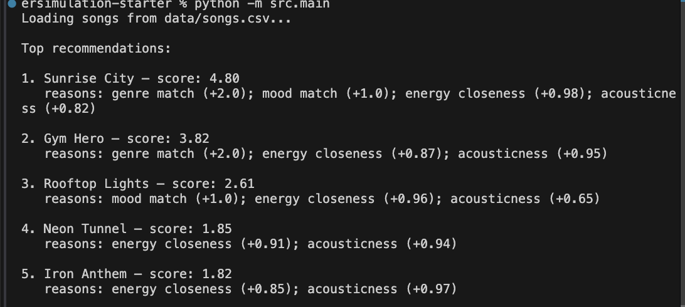
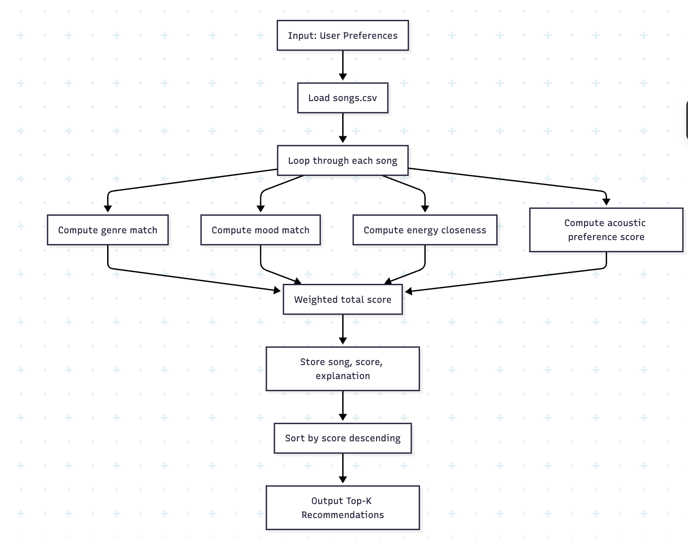
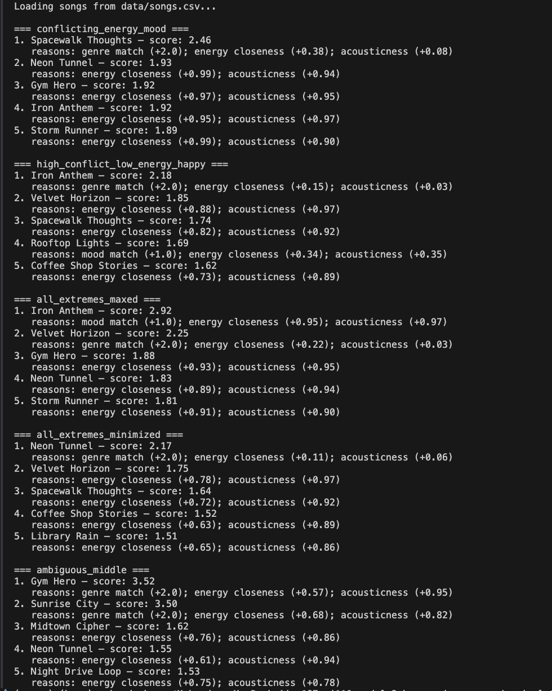

# 🎵 Music Recommender Simulation

## Project Summary

I built a small music recommender that picks songs by comparing each song’s features to a user profile.  
The system checks genre, mood, energy level, and acoustic preference, gives each song a score, and returns the top matches.  
The goal is to make the logic simple and transparent so it is easy to explain why a song was recommended.
---

## How The System Works

Each `Song` includes:
- genre
- mood
- energy
- tempo
- valence
- danceability
- acousticness

Each `UserProfile` stores:
- favorite genre
- favorite mood
- target energy
- whether the user prefers acoustic songs

### Algorithm Recipe

For each song, the recommender computes:

- `genre_match = 1` if genre matches user favorite, else `0`
- `mood_match = 1` if mood matches user favorite, else `0`
- `energy_score = max(0, 1 - abs(song.energy - user.target_energy))`
- `acoustic_score = song.acousticness` if `likes_acoustic=True`, else `1 - song.acousticness`

Final weighted score:

`score = 0.40*genre_match + 0.25*mood_match + 0.20*energy_score + 0.15*acoustic_score`

Recommendation steps:
1. Score every song.
2. Sort songs by score from highest to lowest.
3. Return top `k` songs.

### Potential Biases

This system may over-prioritize genre, which can hide songs that match mood and energy well but are in different genres.  
Because the dataset is small, recommendations may reflect a narrow taste range and repeat similar songs.


---

## Getting Started

### Setup

1. Create a virtual environment (optional but recommended):

   ```bash
   python -m venv .venv
   source .venv/bin/activate      # Mac or Linux
   .venv\Scripts\activate         # Windows

2. Install dependencies

```bash
pip install -r requirements.txt
```

3. Run the app:

```bash
python -m src.main
```

### Running Tests

Run the starter tests with:

```bash
pytest
```

You can add more tests in `tests/test_recommender.py`.

---

## Experiments You Tried

Use this section to document the experiments you ran. For example:

- What happened when you changed the weight on genre from 2.0 to 0.5
ANS. Reducing the genre weight shifted the recommender from a rule-dominated system (genre-heavy) to a similarity-based system, where continuous features (energy, acousticness) had more influence. This resulted in more balanced but less clearly differentiated recommendations.
- What happened when you added tempo or valence to the score
- How did your system behave for different types of users
ANS. When user preferences conflict, the system defaults to whichever feature has the highest weight, often ignoring other mismatched preferences.
For extreme user profiles, the recommender becomes less flexible and repeatedly surfaces a small subset of songs that best match those extremes. 
For users with moderate or unclear preferences, the system produces less differentiated recommendations, as many items satisfy the criteria equally well.
The system does not explicitly resolve trade-offs between conflicting preferences, leading to inconsistent or unintuitive recommendations.

---

## Limitations and Risks

Summarize some limitations of your recommender.
- Works on a small, fixed dataset, limiting diversity
- Relies on manually set weights, which can bias results
- Does not understand audio content or lyrics
- Uses simple similarity metrics that may not reflect human perception
- Struggles with conflicting user preferences
- Does not learn from user feedback over time

You will go deeper on this in your model card.

---

## Reflection

Read and complete `model_card.md`:

[**Model Card**](model_card.md)

Write 1 to 2 paragraphs here about what you learned:

- about how recommenders turn data into predictions
- about where bias or unfairness could show up in systems like this

ANS. I learned that recommenders turn raw data into predictions by converting user preferences and item features into scores. In this project, the system compares each song’s genre, mood, energy, and acousticness against a user profile, then uses weighted logic to rank songs from best match to worst match. Small changes to the weights can noticeably change the results, which shows how much recommender behavior depends on the design of the scoring function.

I also learned that bias and unfairness can show up when one feature is weighted too strongly or when the dataset is too small and repetitive. If genre is overemphasized, the system may keep recommending similar songs and ignore good matches in other categories. A recommender can also be unfair if it reflects only a narrow set of tastes, because users with different preferences may get fewer relevant or diverse results.

---

## 7. `model_card_template.md`

Combines reflection and model card framing from the Module 3 guidance. :contentReference[oaicite:2]{index=2}  

# 🎧 Model Card: Music Recommender Simulation

## 1. Model Name  

**VibeFinder 1.0** 

---

## 2. Intended Use  
This recommender suggests a small set of songs from a fixed catalog based on a user's preferred genre, mood, energy level, and acoustic preference. It is designed for classroom exploration and testing, not for real-world music recommendation.

It assumes user taste can be represented with a few simple preferences and that similar songs can be ranked using a weighted score.




---

## 3. How the Model Works  

The model compares each song to a user profile using genre, mood, energy, and acousticness. A song gets points when its genre matches the user’s favorite genre, when its mood matches, when its energy is close to the user’s target energy, and when its acousticness fits the user’s preference.

The final recommendation score is a weighted sum of those feature matches. I changed the starter logic by increasing the importance of energy and reducing the importance of genre, so energy differences have more influence on the ranking.




---

## 4. Data  

The model uses a small CSV catalog of songs with attributes like genre, mood, energy, tempo, valence, danceability, and acousticness. The dataset is limited, so only a few music styles and moods are represented.

Because the catalog is small, some preferences may be underrepresented. That means the recommender may repeat similar songs or miss more diverse matches.


---

## 5. Strengths  

The system works well when a user has clear preferences and those preferences match features in the catalog. It can give reasonable results for users who care about genre, mood, and energy in a simple way.

It also explains recommendations clearly, which makes it easy to understand why a song was ranked highly.
---

## 6. Limitations and Bias 

The model does not consider lyrics, artist familiarity, listening history, or context like time of day. It also may favor users whose tastes match the most common patterns in the dataset.

If genre is weighted too strongly, the recommender can become repetitive and ignore good matches in other categories. Users with unusual or conflicting tastes may get less useful recommendations.

---

## 7. Evaluation  

I tested the recommender with several user profiles, including normal profiles and adversarial edge cases. I looked at the top-ranked songs and checked whether the explanations matched the scores.

I also changed the feature weights to see whether rankings changed in meaningful ways. This helped show whether the system was sensitive to energy and genre in a balanced way.



---

## 8. Future Work  

The model could be improved by adding more features, such as tempo, valence, or danceability. It would also help to use a larger and more diverse song catalog.

A better version could include diversity logic so the top results are not too similar to each other. It could also provide stronger explanations and learn from user feedback over time.

---

## 9. Personal Reflection  

I learned that recommender systems turn data into predictions by converting user preferences and item features into scores. I also learned that small changes in weights can have a big effect on ranking.

One interesting result was how easily the recommender could over-focus on one feature, especially with a small dataset. This changed the way I think about music apps, because even simple recommendation systems can shape what users see in a strong and biased way.